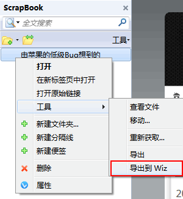
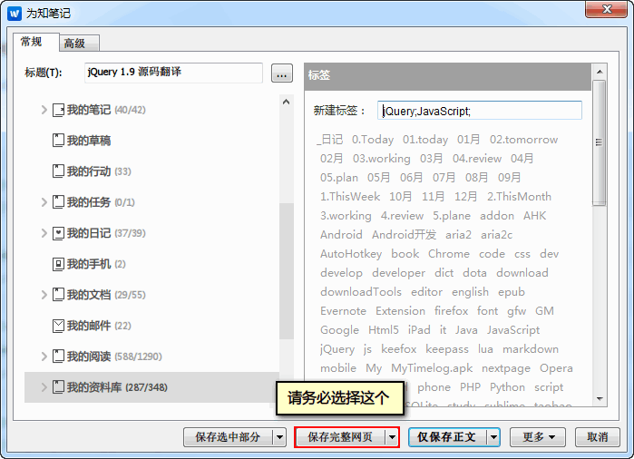

导出 Scrapbook 到 Wiz
=====================

由于 Wiz 自带的保存比较弱，而 Scrapbook 保存很强大，所以就想结合起来。本扩展从 Scrapbook 导出单文件到 Wiz，包括样式、图片等资源。

 - 需要有 WizBrother Wiz Plugin 2.0 扩展。
 - 默认忽略 .ttf 结尾的字体文件。在某些站点 Scrapbook 会保存字体，会让导出到 Wiz 的文件偏大。

安装地址：https://github.com/ywzhaiqi/ExportScrapbookToWiz/releases

